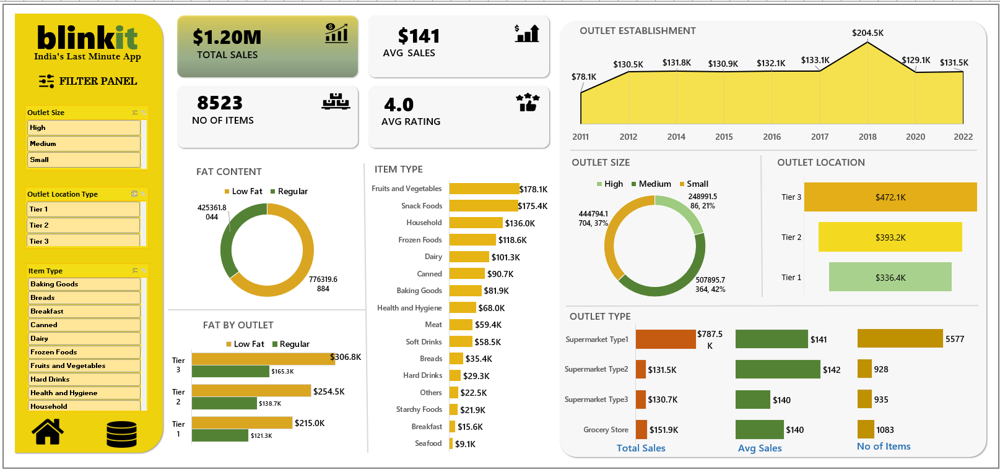

# 📊 BlinkIT Sales Analysis – Excel Dashboard

## 📌 Project Overview

This project analyzes BlinkIT grocery sales data using Microsoft Excel to understand sales performance, product trends, outlet performance, and customer-related metrics.

The project includes data cleaning, data analysis, KPI calculations, PivotTables, charts, and an interactive Excel dashboard to transform raw data into meaningful business insights.

---

## 🎯 Business Objective

The objective of this project is to analyze BlinkIT sales data and identify key patterns in sales performance across different products, outlet types, outlet locations, outlet sizes, and other business dimensions.

The analysis helps provide a clear view of overall sales performance and supports data-driven business decision-making.

---

## 📊 Key Performance Indicators (KPIs)

The dashboard focuses on the following key performance indicators:

- 💰 **Total Sales:** $1.20M
- 📈 **Average Sales:** $141
- 📦 **Number of Items:** 8,523
- ⭐ **Average Rating:** 4.0

---

## 🗂️ Dataset

The dataset contains BlinkIT grocery sales information with **8,523 records** and includes attributes related to:

- Item Type
- Item Fat Content
- Item Weight
- Item Visibility
- Item MRP
- Outlet Type
- Outlet Size
- Outlet Location
- Outlet Establishment Year
- Sales
- Rating

The workbook contains separate worksheets for the dataset, analysis, and dashboard.

---

## 🛠️ Tools & Techniques

### Tool Used

- Microsoft Excel

### Techniques Used

- Data Cleaning
- Data Preparation
- Data Analysis
- KPI Calculation
- PivotTables
- Pivot Charts
- Data Visualization
- Dashboard Development
- Business Insights

---

## 🔄 Project Workflow

```text
Raw Dataset
     ↓
Data Cleaning & Preparation
     ↓
Data Analysis
     ↓
KPI Calculation
     ↓
PivotTables & Charts
     ↓
Interactive Dashboard
     ↓
Business Insights

## 📈 Dashboard Preview



---

## 🔍 Analysis Performed

The analysis explores BlinkIT sales performance across different business dimensions, including:

- Item Type
- Fat Content
- Outlet Type
- Outlet Size
- Outlet Location
- Outlet Establishment Year
- Sales Performance
- Customer Rating

---

## 💡 Key Insights

The analysis was performed to identify important patterns in BlinkIT's sales and outlet performance.

Key findings from the analysis include:

- Sales performance varies across different item categories.
- Outlet characteristics influence overall sales performance.
- Product-level analysis helps identify high- and low-performing categories.
- KPI analysis provides an overall view of sales performance.
- Customer ratings provide an additional perspective on product and outlet performance.

---

## 🎯 Business Recommendations

Based on the analysis, businesses can:

- Monitor the performance of different item categories.
- Compare outlet performance across locations and outlet types.
- Identify opportunities to improve underperforming product categories.
- Track key KPIs regularly to support data-driven decision-making.

---

## 📁 Project Files

| File | Description |
|---|---|
| `BlinkIT_Sales_Analysis2.xlsx` | Complete Excel dataset, analysis and dashboard |
| `BlinkIT_Dashboard.png` | Dashboard preview |

---

## 🧠 Skills Demonstrated

**Microsoft Excel | Data Cleaning | Data Analysis | PivotTables | Pivot Charts | KPI Analysis | Data Visualization | Dashboard Development | Business Insights**

---

## 👩‍💻 Author

**Aishwarya Jadhav**

Data Analytics | Excel | SQL | Power BI | Python | Tableau
